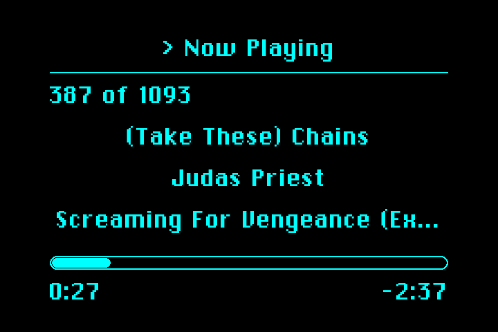
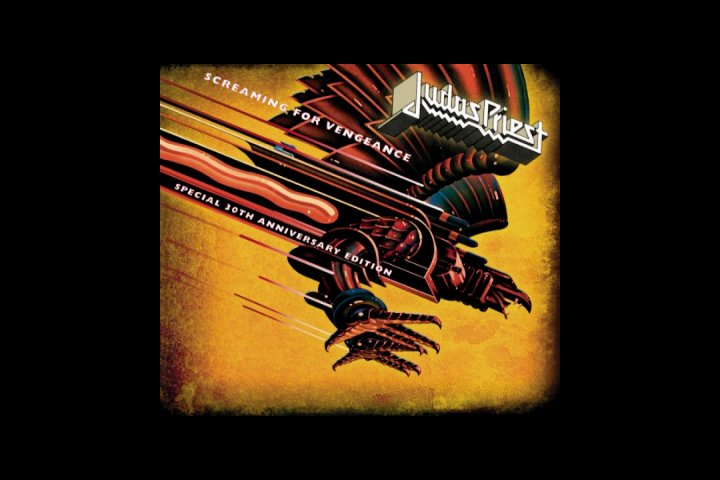

# bebop

An iPod-style MP3 player interface for a Raspberry Pi 3B+ driving a
4:3 CRT over composite video. Recreates the menu hierarchy, monochrome
look, and navigation of a first-generation iPod, plus one feature the
original never had: a dedicated fullscreen Album Art Mode.

bebop is a graphical [MPD](https://www.musicpd.org/) client only -- no
audio decoding, library indexing, or playback-queue logic lives here;
all of that is MPD's job. bebop just renders the screen and sends MPD
commands.





Status: v1.1, deployed fleet-wide as part of
[McBrain](https://github.com/LawtonBarnes/mcbrain) (production + all 4
puppets), assigned as the active app on `production` and `puppet2`.

## Hardware

- Raspberry Pi 3B+, Raspberry Pi OS (Debian 12 bookworm)
- 4:3 CRT over composite video (NTSC, 720x480 real framebuffer)
- Analog audio out (`hw:0,0`, the Pi's headphone jack) at line level --
  volume is controlled by an external amp, not bebop or MPD
- A remote control's D-pad/Select/Back, read via evdev -- either a
  physical dongle plugged directly into the Pi, or (when installed as a
  McBrain puppet) relayed live over HTTP by
  [STRINGS](https://github.com/LawtonBarnes/strings)'s virtual input
  device. bebop's own code is identical either way; no relay-specific
  logic exists here.
- Music library: a single shared read-only network share
  (`config.toml`'s `music_directory`, mounted at `/mnt/bebop` via CIFS/
  Samba from whichever machine actually holds the USB drive), so every
  fleet machine sees the same library without needing its own copy.

## Controls

| Button | List screens | Now Playing | Album Art Mode |
|---|---|---|---|
| D-pad Up/Down | Move selection | -- | -- |
| D-pad Left/Right | Page 10 rows at a time | Previous/next track | -- |
| Select/OK | Choose item | Play/pause | -- |
| Back | Up one menu level (no-op at the root `bebop` menu) | Up one menu level | Up one menu level |
| Hamburger | Exits bebop (fleet-wide convention) | Toggle to Album Art Mode | Toggle back to Now Playing |
| Home/Q/Esc | Exit bebop | Exit bebop | Exit bebop |

## Menu structure

```
bebop
  Playlists          -- MPD's saved playlists -> songs
  Artists             -> Albums (track-number order) -> songs
  Songs               -- every track, alphabetical by title
  Settings
    Shuffle: Off/Songs/Albums   -- picking Songs/Albums reshuffles
                                   the current (or whole-library)
                                   queue and starts playing immediately
    Repeat: Off/One/All
    Text Color: Orange/Green/White/Cyan
    About                        -- song count, disk capacity/free, version
```

Selecting a song from Songs/an album/a playlist replaces the queue
with that whole list (so Left/Right on Now Playing walks the same
order shown on screen) and starts playing the chosen track.

## Album Art Mode

Toggled by the hamburger button from Now Playing. Ignores the menu
screens' safe-area/underscan margin entirely and draws nothing but the
artwork -- no title, no progress bar, no borders -- centered on the
full frame, per the design brief.

Art is preferred from embedded MP3 tags (mutagen, front-cover APIC
frame if more than one is embedded), falling back to `cover.jpg`/
`folder.jpg`-style files in the track's own directory
(`config.toml`'s `artwork.fallback_filenames`), falling back to
`assets/no_album_art.png` if neither exists. Extracted art is cached
in memory (bounded to 50 tracks) and downscaled to `artwork_size`
(400) on first load.

**Pixel-aspect correction:** composite's 720x480 framebuffer is not
square-pixel -- on a real 4:3 CRT, a naively-drawn square reads
noticeably squished. Both the splash screen and Album Art Mode
pre-stretch source images horizontally by `display.pixel_aspect_correction()`
before fitting them to the target box, so they read as true squares/
circles on the actual CRT. (A plain screenshot of the framebuffer
looks slightly *too wide* -- that's expected; the physical, non-square
composite pixels are what corrects it back to true proportions.)

## Setup

```
sudo apt-get install -y mpd mpc python3-mutagen cifs-utils
python3 -m venv --system-site-packages /opt/bebop/venv
/opt/bebop/venv/bin/pip install -r requirements.txt
```

The venv uses `--system-site-packages` so it inherits the system's
apt-installed evdev/numpy/mutagen/Pillow/psutil -- only `pygame-ce`
and `python-mpd2` are venv-local (`pygame-ce` can't coexist with the
stock `pygame` the rest of the McBrain fleet's apps depend on, hence
the dedicated venv at all).

**Mount the shared library** (adjust the host IP/share name to your own
setup -- whichever machine actually holds the USB drive needs a Samba
share exported as `bebop-music`):

```
sudo tee -a /etc/fstab > /dev/null << 'EOF'
//<library-host-ip>/bebop-music /mnt/bebop cifs guest,ro,vers=3.0,uid=metalshop,gid=metalshop,iocharset=utf8,_netdev,nofail,x-systemd.automount,x-systemd.device-timeout=10 0 0
EOF
sudo systemctl daemon-reload
```

**This hardcodes the library host's IP** -- if that machine's address
ever changes (a router reset, a new DHCP lease), every machine's mount
silently breaks (`ls /mnt/bebop` fails with "No such device") until
`/etc/fstab` is updated to match on every machine and `daemon-reload`'d.
Not part of any git repo, so it isn't caught by a normal fleet sync --
worth checking directly (`mount | grep bebop`) any time fleet IPs have
recently changed.

Point MPD at the library and disable its software mixer (volume is
external): edit `/etc/mpd.conf`'s `music_directory` to match
`config.toml`'s `[mpd] music_directory`, and add:

```
audio_output {
    type       "alsa"
    name       "bebop RCA out"
    device     "hw:0,0"
    mixer_type "disabled"
}
```

Then `sudo systemctl enable --now mpd`, `mpc update`, and either start
bebop by hand via `/usr/local/bin/bebop` (installs itself onto tty1 if
run from a real console, or via `sudo openvt` otherwise -- same
launcher pattern as bars/loudness/channel38), or, as part of a McBrain
fleet, assign it through STRINGS/SCRUTE instead of launching it
directly.

## Configuration

- `config.toml` -- static machine config: display resolution/safe
  area, font/splash paths, MPD host/port/music_directory, artwork
  size/fallback filenames. Hand-edited, read once at startup.
- `settings.ini` -- live user preferences (Shuffle, Repeat, Text
  Color), set via the Settings menu and persisted with a
  comment-preserving surgical edit (never `configparser.write()`,
  which discards `config.toml`'s neighbor file's comments -- see
  `config.save_setting()`).

## Architecture

One module per concern, per the brief:

- `bebop.py` -- entry point: evdev input loop, FrameBuffer output,
  screen-stack dispatch, splash, pixel-aspect correction
- `display.py` -- `FrameBuffer` (direct `/dev/fb0` writer, same
  technique as bars.py) and `Renderer` (fonts sized to fit a target
  column count within the safe area, chevrons, text truncation)
- `menu.py` -- the stack-based screen model; builds every MPD-backed
  list screen (Songs/Artists/Albums/Playlists/Settings)
- `nowplaying.py` / `albumart.py` -- the two playback-observing
  screens, both read MPD's live state fresh on every render
- `mpdclient.py` -- thin MPD client wrapper with auto-reconnect
- `artwork.py` -- embedded/fallback art extraction + a bounded cache
- `config.py` -- `config.toml`/`settings.ini` loading and persistence

## Known gaps

- **SCRUTE control-mode Back relay**: STRINGS's `/input` relay
  allowlist includes `KEY_BACK` (added specifically for bebop's
  internal "go up a level" navigation, unlike every other app's Back =
  "exit"), but `scrutinizer.py`'s control-mode keycode handler still
  intercepts `KEY_BACK` unconditionally before it would ever reach the
  relay branch -- needs its own follow-up change (make that branch
  app-aware, or accept Home as control-mode's only exit while
  targeting bebop) to avoid changing working behavior for every other
  app.
- **`cover.jpg`/`folder.jpg` fallback lightly tested** -- most of the
  current library has embedded art, so this code path sees limited
  real-world exercise.
- **No in-app playlist creation** -- Playlists browses whatever MPD
  already has saved; there's no "save current queue as a playlist"
  action in the UI yet.

## Per-machine settings

`settings.ini` is per-machine and not tracked in git (each fleet host keeps
its own values, e.g. calibration or preferences), so `git pull` never
conflicts with it. A fresh install copies the template first:

    cp settings.example.ini settings.ini

If `settings.ini` is missing, the app falls back to its built-in defaults.
